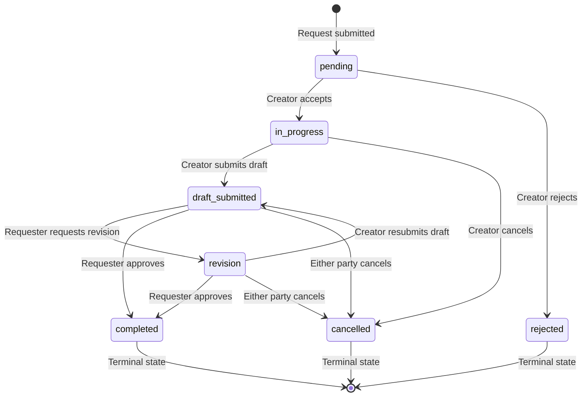

# Request / Commission Action Flows

## 1. Overview

The Request system (never called "commission" in code) allows users to request creative work from creators through a structured state-machine workflow. It is modeled after platforms like Pixiv's request/commission system.

**Key concepts:**

- **RequestTerm ("plan")** — A creator publishes a plan defining what work types they accept, their target price, estimated delivery days, rules, and maximum concurrent request slots.
- **Request** — An individual request submitted by a requester against a creator's plan. Each request moves through a defined state machine from `pending` through to `completed`, `rejected`, or `cancelled`.
- **Creator** — The user fulfilling the request. Publishes plans, accepts/rejects requests, submits drafts, delivers final files.
- **Requester** — The user commissioning the work. Submits requests, requests revisions, approves completion.

**Data flow:** Backend validation lives in `backend/utils/requestValidation.js` with the `canTransitionRequest()` function enforcing all state changes. The `transitionRequest()` helper in `backend/controllers/request.controller.js` performs the actual transition and logs an event. Notifications are sent to the other participant on key transitions.

---

## 2. State Machine



---

## 3. States Table

| Status | Description | Terminal | Active |
|--------|-------------|----------|--------|
| `pending` | Request submitted; awaiting creator decision | No | No |
| `in_progress` | Creator accepted and is actively working | No | **Yes** |
| `draft_submitted` | Creator submitted draft files; awaiting requester action | No | **Yes** |
| `revision` | Requester requested changes; creator reworking | No | **Yes** |
| `completed` | Final files delivered and/or approved; all done | **Yes** | No |
| `rejected` | Creator declined the request | **Yes** | No |
| `cancelled` | Either party terminated the request | **Yes** | No |

**Active states** are defined in `ACTIVE_REQUEST_STATUSES` and include `in_progress`, `draft_submitted`, and `revision`. These states count toward a creator's open request capacity.

---

## 4. Transitions Table

| From | To | Action | Performer | API Endpoint | Notes |
|------|----|--------|-----------|-------------|-------|
| `pending` | `in_progress` | accept | Creator | `POST /api/requests/:id/accept` | Sets `dueAt` to now + 60 days. Opens private chat room. Work begins immediately. |
| `pending` | `rejected` | reject | Creator | `POST /api/requests/:id/reject` | Optional reason in body. |
| `in_progress` | `draft_submitted` | submitDraft | Creator | `POST /api/requests/:id/draft` | Multipart. Requires `draftFiles`. Sets `autoCompleteAt` to now + 7 days. |
| `in_progress` | `cancelled` | cancel | Creator | `POST /api/requests/:id/cancel` | Only creator can cancel from in_progress. |
| `draft_submitted` | `revision` | createRevision | Requester | `POST /api/requests/:id/revisions` | Max 2 rounds. Requires `notes` in body. |
| `draft_submitted` | `completed` | approve | Requester | `POST /api/requests/:id/approve` | Closes chat. |
| `draft_submitted` | `cancelled` | cancel | Either participant | `POST /api/requests/:id/cancel` | Closes chat. |
| `revision` | `draft_submitted` | submitDraft | Creator | `POST /api/requests/:id/draft` | Same endpoint; re-enters draft_submitted state. |
| `revision` | `completed` | approve | Requester | `POST /api/requests/:id/approve` | Closes chat. |
| `revision` | `cancelled` | cancel | Either participant | `POST /api/requests/:id/cancel` | Closes chat. |

### Non-transition Actions

These actions do not change the request's status but are part of the request workflow:

| Action | Performer | Endpoint | Notes |
|--------|-----------|----------|-------|
| Extension | Creator | `POST /api/requests/:id/extension` | Max 30 days, once per request. Extends `dueAt`. |
| Complete* | Creator | `POST /api/requests/:id/complete` | Uploads `finalFiles` (required) + `giftFiles` (optional). Transitions to `completed` directly. Requires `draft_submitted` or `revision` status. **This is a separate path from `approve` — the creator can finalize without requester approval.** |

*\*Note: `complete` is a creator-initiated action that transitions the request to `completed` (skipping requester approval). The `approve` action is requester-initiated and also transitions to `completed` from `draft_submitted` or `revision` states. Either party can finalize, but by different endpoints.*

---

## 5. API Endpoint Reference

### Plans (RequestTerms)

| Method | Endpoint | Auth | Description |
|--------|----------|------|-------------|
| `POST` | `/api/requests/terms` | `protect` | Create a new request plan (term). Validated via `validateRequestTermPayload`. |
| `GET` | `/api/requests/terms` | None | List request terms. Supports `?creator=X` to filter by creator. `?openOnly=true` (default) filters to open plans only. |
| `PATCH` | `/api/requests/terms/:id` | `protect` | Update own term. Creator must match. Re-validates full payload. |

### Requests

| Method | Endpoint | Auth | Description |
|--------|----------|------|-------------|
| `POST` | `/api/requests` | `protect` | Submit a new request. Multipart with up to 15 reference images. |
| `GET` | `/api/requests/mine` | `protect` | List current user's requests. `?role=creator|requester`, `?status=X`. Max 80 results by default (200 cap). |
| `GET` | `/api/requests/public` | None | List public requests. Excludes sensitive fields (`-description -specifics -referenceImages -giftFiles`). Filters to accepted/in_progress/draft_submitted/completed. |
| `GET` | `/api/requests/:id` | `protect` | Get request detail. Participants can see all; non-participants can only see public requests. |
| `POST` | `/api/requests/:id/accept` | `protect` | Creator accepts a pending request. Sets 60-day due date. |
| `POST` | `/api/requests/:id/reject` | `protect` | Creator rejects a pending request. |
| `POST` | `/api/requests/:id/start` | `protect` | Creator starts work. |
| `POST` | `/api/requests/:id/cancel` | `protect` | Either participant cancels. Closes chat room. |
| `POST` | `/api/requests/:id/extension` | `protect` | Creator requests deadline extension (1–30 days, once per request). |
| `POST` | `/api/requests/:id/draft` | `protect` | Creator submits draft files. Multipart, `draftFiles` field, max 5 files. Sets 7-day auto-complete timer. |
| `POST` | `/api/requests/:id/revisions` | `protect` | Requester requests revision. Requires `notes` in body. Max 2 rounds. |
| `POST` | `/api/requests/:id/complete` | `protect` | Creator uploads final files. Multipart: `finalFiles` (required, max 5) + `giftFiles` (optional, max 5). Transitions to `completed` directly. |
| `POST` | `/api/requests/:id/approve` | `protect` | Requester approves delivery. Transitions to `completed`. |
| `GET` | `/api/requests/:id/chat` | `protect` | Get chat messages. Sorted chronologically. Max 300 messages. |
| `POST` | `/api/requests/:id/chat` | `protect` | Send chat message. Multipart with optional `attachments` (max 10 files). Message text or attachment required. Chat must not be closed. |
| `GET` | `/api/requests/:id/events` | `protect` | Get request event history/log. Participants and admins only. |
| `POST` | `/api/requests/:id/report` | `protect` | Report/dispute a request. Logs event, notifies all admins. |

### Admin

| Method | Endpoint | Auth | Description |
|--------|----------|------|-------------|
| `GET` | `/api/requests/admin/reported` | `protect` + `admin` | List all reported requests with aggregation and pagination. |
| `POST` | `/api/requests/admin/:id/resolve-report` | `protect` + `admin` | Resolve a report. Accepts `action` (dismiss/warn/ban) and `note`. |

---

## 6. Frontend Components & Routes

### Vue Router

| Path | View Component | Auth | Description |
|------|---------------|------|-------------|
| `/requests/manage` | `RequestManagementView` | `requiresAuth` | Main request management page. Loaded lazily via router. |

### Component Tree

```
RequestManagementView.vue
  ├── MainLayoutTemplate.vue (wrapper with sidebar + topbar)
  ├── Create Request Plan form (inline in the view)
  ├── Request Queue (inline list in the view)
  │   └── Request rows with action buttons (Accept / Reject / Start / Cancel)
  └── RequestDetailPanel.vue (slide-over panel, conditionally rendered)
      ├── Details tab
      │   ├── Request Info (status, workType, amount, other party)
      │   ├── Specifics (pose, outfit, mood, lighting, angle)
      │   └── Files section (reference images, draft files, final files, gift files)
      └── Chat tab
          ├── Message list (user messages + system messages)
          └── Chat input (textarea + file attachment + send button)
```

### `RequestManagementView.vue` (line 1–597)

- **State:** Uses `useAuthStore` and `useRequestStore` (Pinia).
- **Role filter:** Toggle between `creator` and `requester` role to view different queues.
- **Status filter:** Dropdown to filter by any request status.
- **Inline actions:** Direct action buttons in the queue rows for quick Accept/Reject/Start/Cancel.
- **Detail panel:** Clicking a request row loads full detail via `fetchById()` and slides open the detail panel.
- **Chat:** The chat tab loads messages on switch via `fetchChatMessages()` and sends via `sendChatMessage()`.

### `ProfileRequestsSection.vue` (line 1–477)

- **Location:** Rendered within a creator's profile page (`/account?tab=requests` or user profile).
- **Plans display:** Shows cards for each request term.
- **Submit form:** If viewer is not the profile owner and the creator has open plans, shows a submission form.
- **Form fields:** Title, proposed amount, work type, visibility, description, specifics (pose/outfit/mood/lighting/angle), tags, age rating, reference images, anonymous toggle.
- **Submission:** Uses `requestStore.submitRequest()` with `FormData`.

### `RequestDetailPanel.vue` (line 1–527)

- **Props:** `request` (object), `loading` (boolean), `activeRole` (string).
- **Exposes:** `updateChatMessages()`, `setChatLoading()` for parent communication.
- **File display:** Groups files by type (reference images, draft files, final files, gift files). Image files render as thumbnails; non-images render as download links with file-type icons.
- **Chat:** System messages are rendered with an info icon and italic styling. User messages show sender name, timestamp, text content, and file attachments. Chat input supports multi-file attachment and keyboard submit.

### Pinia Store (`request.store.js`)

| Action | API Call | Description |
|--------|----------|-------------|
| `createTerm(payload)` | `POST /requests/terms` | Creates a new plan and prepends to local terms list. |
| `fetchTerms(params)` | `GET /requests/terms` | Fetches request terms with optional filters. |
| `submitRequest(formData)` | `POST /requests` | Submits a new request via multipart form. |
| `fetchMine(params)` | `GET /requests/mine` | Fetches current user's requests. |
| `fetchById(requestId)` | `GET /requests/:id` | Fetches single request detail. |
| `transition(id, action)` | Various | Maps action names to API calls. Current mapping: `accept`/`reject`/`start`/`cancel`. Updates the local requests array with the response. |
| `getChat(requestId)` | `GET /requests/:id/chat` | Fetches chat messages. |
| `sendChat(requestId, formData)` | `POST /requests/:id/chat` | Sends chat message with optional file attachments. |

**Note:** The `transition()` action currently only supports four actions (`accept`, `reject`, `start`, `cancel`). Other state-changing actions (`submitDraft`, `createRevision`, `complete`, `approve`) are not yet mapped and must be called through the raw `requestApi` methods.

### API Service (`api.js`)

The `requestApi` object exposes all request endpoints as typed methods:

```javascript
requestApi.getTerms(params)
requestApi.createTerm(payload)
requestApi.updateTerm(termId, payload)
requestApi.create(formData)         // multipart
requestApi.getMine(params)
requestApi.getPublic(params)
requestApi.getById(requestId)
requestApi.accept(requestId)
requestApi.reject(requestId, payload)
requestApi.start(requestId)
requestApi.cancel(requestId, payload)
requestApi.submitDraft(requestId, formData)    // multipart
requestApi.createRevision(requestId, payload)
requestApi.complete(requestId, formData)        // multipart
requestApi.approve(requestId)
requestApi.getChat(requestId)
requestApi.sendChat(requestId, formData)        // multipart
requestApi.report(requestId, payload)
```

---

## 7. Auth Matrix

| Endpoint | protect | admin | Creator only | Requester only | Either participant |
|----------|---------|-------|-------------|----------------|-------------------|
| `POST /requests/terms` | ✅ | | | | |
| `GET /requests/terms` | | | | | |
| `PATCH /requests/terms/:id` | ✅ | | ✅ (must own term) | | |
| `POST /requests` | ✅ | | | | |
| `GET /requests/mine` | ✅ | | | | |
| `GET /requests/public` | | | | | |
| `GET /requests/:id` | ✅ | | | | ✅ (for private) |
| `POST /requests/:id/accept` | ✅ | | ✅ | | |
| `POST /requests/:id/reject` | ✅ | | ✅ | | |
| `POST /requests/:id/start` | ✅ | | ✅ | | |
| `POST /requests/:id/cancel` | ✅ | | | | ✅ |
| `POST /requests/:id/extension` | ✅ | | ✅ | | |
| `POST /requests/:id/draft` | ✅ | | ✅ | | |
| `POST /requests/:id/revisions` | ✅ | | | ✅ | |
| `POST /requests/:id/complete` | ✅ | | ✅ | | |
| `POST /requests/:id/approve` | ✅ | | | ✅ | |
| `GET /requests/:id/chat` | ✅ | | | | ✅ |
| `POST /requests/:id/chat` | ✅ | | | | ✅ (chat must be open) |
| `GET /requests/:id/events` | ✅ | ✅ (explicitly allowed) | | | ✅ |
| `POST /requests/:id/report` | ✅ | | | | ✅ |
| `GET /requests/admin/reported` | ✅ | ✅ | | | |
| `POST /requests/admin/:id/resolve-report` | ✅ | ✅ | | | |

**How auth is enforced:**

- `protect` — JWT token required via `auth.middleware.js`. Sets `req.user`.
- `admin` — Checks `req.user.role === 'admin'`. Used after `protect`.
- **Creator check** — `ensureCreator(request, userId)` helper in the controller compares the user against `request.creator`.
- **Requester check** — `ensureRequester(request, userId)` helper in the controller compares the user against `request.requester`.
- **Participant check** — `ensureParticipant(request, userId)` checks if user is either creator or requester.

**Note:** These are not Express middleware functions but inline helper functions called within each controller handler. They set `res.status(403)` and throw `new Error(...)` when the check fails.

---

## 8. Validation Rules

### Plan Creation (`validateRequestTermPayload`)

| Field | Rule |
|-------|------|
| `title` | Required, non-empty string |
| `targetPrice` | Required, must be > 0 |
| `acceptedWorkTypes` | Required, must be a non-empty array of valid types: `illust`, `manga`, `gif`, `novel` |
| `estimatedDays` | Required integer, min 14, max 60 |
| `maxOpenRequests` | Required integer, min 1, max 20 |
| `rules` | Required, non-empty string |
| `strengths` | Required, non-empty string |

### Request Submission (`validateRequestSubmission`)

| Field | Rule |
|-------|------|
| `title` | Required, non-empty string |
| `description` | Required, non-empty string |
| `workType` | Required, must be one of `illust`/`manga`/`gif`/`novel`, AND must be in the plan's `acceptedWorkTypes` |
| `proposedAmount` | Required, must be >= the plan's `targetPrice` |
| `openRequestCount` | Validated against `maxOpenRequests`; creator's active requests must be below capacity |
| `visibility` | Optional, must be `public` or `private` (defaults to `private`) |
| `ageRating` | Optional, must be `all` or `r-18` (defaults to `all`) |
| `referenceImages` | Optional, max 15 files |

### Additional Rules

| Action | Rule |
|--------|------|
| **Accept** | Request must be `pending`. Only the creator of the plan can accept. Sets `dueAt` to 60 days from now. |
| **Reject** | Request must be `pending`. Only the creator. |
| **Cancel** | Request must be in a cancellable state (any state except terminal). Either participant can cancel. Closes chat. |
| **Start** | Request must be `accepted`. Only the creator. |
| **Draft** | Request must be `in_progress` or `revision`. Only the creator. Requires at least 1 draft file (max 5). Sets `autoCompleteAt` to 7 days from submission. |
| **Revision** | Request must be `draft_submitted` or `revision`. Only the requester. Max 2 revision rounds (`revisionCount` tracked on request). Requires `notes` in body. Increments `revisionCount`. |
| **Complete** | Request must be `draft_submitted` or `revision`. Only the creator. Requires at least 1 final file. Closes chat. |
| **Approve** | Request must be `draft_submitted` or `revision`. Only the requester. Closes chat. |
| **Extension** | Request can be extended once. `extensionDays` must be 0 (not previously used). Days must be 1–30. Extends `dueAt`. Logs event. |
| **Chat** | Both participants can send/receive. Chat must not be closed (`chatClosedAt` must be null). Message must have text content or file attachments. Max 10 file attachments per message. |
| **Report** | Only participants can report. Creates a `request_reported` event. Notifies all admin users. |
| **Self-request** | Creators cannot request their own plan. Checked at submission time: `term.creator !== req.user._id`. |

### File Upload Rules

| Aspect | Limit |
|--------|-------|
| Max file size | Configurable via `MAX_UPLOAD_FILE_SIZE_MB` env var (default 10 MB) |
| Reference images | Max 15 files |
| Draft files | Max 5 files |
| Final files | Max 5 files |
| Gift files | Max 5 files |
| Chat attachments | Max 10 files |
| Allowed MIME types | `image/*`, `application/pdf`, `application/zip`, `octet-stream` |
| Allowed extensions | `jpg`, `jpeg`, `png`, `webp`, `gif`, `pdf`, `psd`, `clip`, `zip` |

---

## 9. Implementation Notes

### Terminology
- The project uses **"request"** terminology throughout — never "commission." This applies to:
  - Database collections: `Request`, `RequestTerm`, `RequestChatMessage`, `RequestEvent`, `RequestRevision`
  - API routes: all under `/api/requests/...`
  - Store: `useRequestStore` with actions like `submitRequest`, `fetchMine`
  - UI: "Request Management," "Create Request Plan," "Submit Request"

### Backend CommonJS
- The backend uses CommonJS (`require`/`module.exports`). Do not use ESM `import`/`export` in backend files.

### Auth Helper Functions
- `ensureParticipant`, `ensureCreator`, and `ensureRequester` are **not Express middleware** — they are helper functions defined inline in `request.controller.js`. They are invoked within each controller handler and manually set `res.status(403)` + call `next(new Error(...))` on failure.

### State Machine Enforcement
- All state transitions are gated through `canTransitionRequest(fromStatus, toStatus)` in `requestValidation.js`.
- The `transitionRequest()` helper in the controller calls this validation, saves the request, logs an event via `logRequestEvent()`, and returns the updated request.
- **Important:** The request store's `transition()` action only maps `accept`, `reject`, `start`, and `cancel`. Calling `submitDraft`, `createRevision`, `complete`, or `approve` from the store requires accessing `requestApi` directly or extending the store.

### Deadline Tracking
- **`dueAt`:** Set to 60 days from acceptance. Can be extended once by creator (1–30 days) via the extension endpoint.
- **`autoCompleteAt`:** Set to 7 days from draft submission. This appears intended for auto-completion if the requester does not respond, but the auto-complete logic is not yet implemented in the controller.

### Chat Room Lifecycle
- The chat room is **opened** automatically when a request is accepted (system message: "Private request room opened after creator acceptance.").
- The chat room is **closed** when:
  - The request is cancelled (`chatClosedAt` set in `cancelRequest`)
  - Final files are delivered via `complete` (`chatClosedAt` set in `completeRequest`)
  - The requester approves via `approve` (`chatClosedAt` set in `approveRequest`)
- Once `chatClosedAt` is set, no further messages can be sent (checked in `createRequestChatMessage`).

### Chat Messages
- Two types: **user messages** (sender has content + optional attachments) and **system messages** (`isSystem: true`, generated by backend on state transitions like acceptance).
- Max 300 messages returned per chat fetch.

### Completing Requests: Two Paths
There are two distinct ways to reach the `completed` terminal state:

1. **Creator-complete:** Creator uploads final files via `POST /api/requests/:id/complete`. This transitions directly to `completed` and closes the chat. The requester is notified but does not need to approve.
2. **Requester-approve:** Requester approves via `POST /api/requests/:id/approve`. This also transitions to `completed` and closes the chat. Available from `draft_submitted` or `revision` states.

Both paths are valid and independent. The creator does not need the requester's approval to finalize (and vice versa — either can trigger `completed` from the appropriate states).

### Frontend Gaps
- The `RequestManagementView` currently only shows inline action buttons for **creator** role actions (Accept, Reject, Start, Cancel). Requester-side actions (approve, request revision) are not rendered in the queue rows.
- The `transition()` store action only supports 4 actions. If new actions are needed from the management view, the store action map must be extended.

### Event Logging
- Every state transition is logged as a `RequestEvent` document with: `request`, `actor`, `type` (e.g. `request_accepted`, `draft_submitted`, `revision_requested`), `fromStatus`, `toStatus`, and optional `metadata`.
- Non-transition events are also logged: `request_submitted` (on creation), `extension_requested` (on extension), `request_reported` (on report), `report_resolved` (admin action).
- Events are retrievable via `GET /api/requests/:id/events` by participants and admins.

### Visibility & Access Control
- Requests default to **private** visibility.
- Private requests are only visible to participants (creator and requester).
- Public requests are listed in `GET /api/requests/public` but with sensitive fields stripped (`description`, `specifics`, `referenceImages`, `giftFiles`).
- Only requests with status `accepted`, `in_progress`, `draft_submitted`, or `completed` appear in the public list.

### Extension System
- Only the creator can request an extension.
- Maximum extension is 30 days, capped at 30 regardless of input.
- Minimum extension is 1 day.
- Only **one** extension per request (`extensionDays > 0` check prevents multiple uses).
- Extends `dueAt` by the specified number of days. If `dueAt` was null, it sets it relative to the current date.

### Revision System
- Max **2 revision rounds** (`revisionCount` maxes at 2).
- Each revision creates a `RequestRevision` document storing the round number and notes.
- Revisions can be requested from `draft_submitted` or `revision` states (allowing chained revisions up to the cap).
- After the 2nd revision, the requester must either approve or cancel — no further revisions possible.

### Known Quirk: Bootstrap Global Heading Colors
As noted in the project AGENTS.md, Bootstrap sets global colors on `h1`–`h6` (e.g. `h2 { color: #0f172a }`). In the request detail panel and management view, if heading elements appear inside dark-themed or custom-colored containers, they may inherit Bootstrap's global color instead of the expected color. Always set an explicit `color` value on heading elements inside themed panels.

