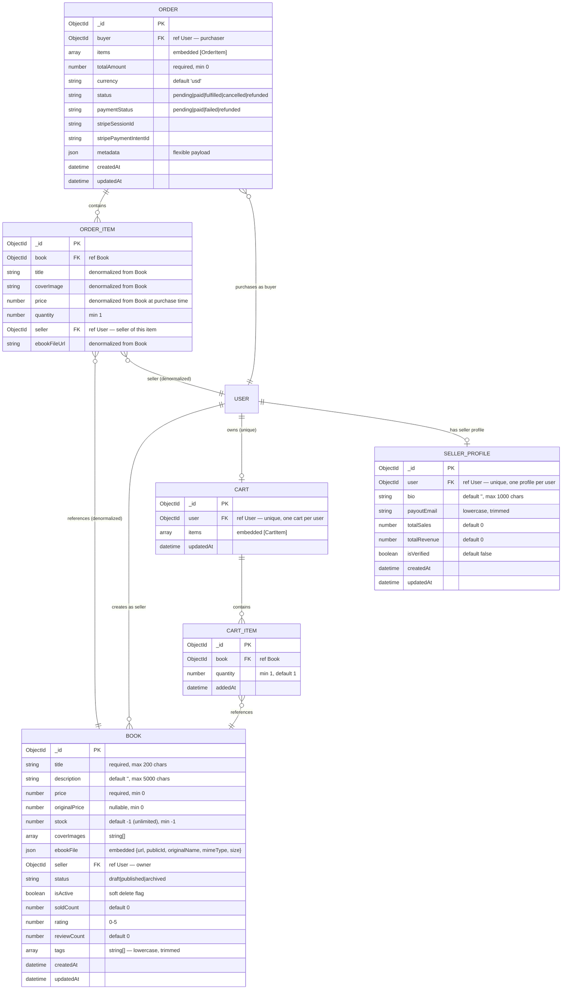

# Book Store Service — Entity-Relationship Diagram

> **Cập nhật:** 2026-07-16
> **Entities:** 5 Mongoose models
> **Description:** ERD của Book Store Service microservice

---



---

## Danh sách Entities

| # | Entity | Mongoose Collection | Fields | Mô tả |
|---|--------|---------------------|--------|-------|
| 1 | **BOOK** | `book_books` | 15 | Sách điện tử (title, price, ebook file, cover, seller, status) |
| 2 | **CART** | `book_carts` | 3 | Giỏ hàng (user, items array, updatedAt) |
| 3 | **CART_ITEM** | (embedded in CART) | 3 | Sản phẩm trong giỏ hàng (book ref, quantity, addedAt) |
| 4 | **ORDER** | `book_orders` | 10 | Đơn hàng (buyer, items, total, status, payment info) |
| 5 | **ORDER_ITEM** | (embedded in ORDER) | 6 | Sản phẩm trong đơn hàng (denormalized book data, seller) |
| 6 | **SELLER_PROFILE** | `book_sellerprofiles` | 7 | Hồ sơ người bán (bio, payout email, stats, verification) |

---

## Chi tiết Fields

### BOOK

| Field | Type | Required | Default | Validation | Mô tả |
|-------|------|:--------:|---------|------------|-------|
| `title` | String | ✅ | - | max 200 chars, trim | Tiêu đề sách |
| `description` | String | ❌ | `''` | max 5000 chars | Mô tả sách |
| `price` | Number | ✅ | - | min 0 | Giá bán (USD) |
| `originalPrice` | Number | ❌ | `null` | min 0 | Giá gốc (hiển thị giảm giá) |
| `stock` | Number | ❌ | `-1` | min -1 | Số lượng tồn kho (-1 = không giới hạn) |
| `coverImages` | [String] | ❌ | `[]` | - | URL ảnh bìa |
| `ebookFile` | Object | ✅ | - | - | Thông tin file ebook |
| `ebookFile.url` | String | ✅ | - | - | URL tải file |
| `ebookFile.publicId` | String | ✅ | - | - | ID trên Cloudinary |
| `ebookFile.originalName` | String | ❌ | `''` | - | Tên file gốc |
| `ebookFile.mimeType` | String | ❌ | `''` | - | Loại file |
| `ebookFile.size` | Number | ❌ | `0` | - | Kích thước file (bytes) |
| `seller` | ObjectId | ✅ | - | ref User | Người bán |
| `status` | String | ❌ | `'draft'` | enum: draft, published, archived | Trạng thái |
| `isActive` | Boolean | ❌ | `true` | - | Soft delete flag |
| `soldCount` | Number | ❌ | `0` | min 0 | Số lượng đã bán |
| `rating` | Number | ❌ | `0` | min 0, max 5 | Đánh giá trung bình |
| `reviewCount` | Number | ❌ | `0` | min 0 | Số lượt đánh giá |
| `tags` | [String] | ❌ | `[]` | lowercase, trim | Thẻ phân loại |

### CART

| Field | Type | Required | Default | Mô tả |
|-------|------|:--------:|---------|-------|
| `user` | ObjectId | ✅ | - | ref User (unique) |
| `items` | [CartItem] | ❌ | `[]` | Danh sách sản phẩm |
| `updatedAt` | Date | - | `Date.now` | Thời gian cập nhật |

### ORDER

| Field | Type | Required | Default | Validation | Mô tả |
|-------|------|:--------:|---------|------------|-------|
| `buyer` | ObjectId | ✅ | - | ref User | Người mua |
| `items` | [OrderItem] | ✅ | - | - | Danh sách sản phẩm |
| `totalAmount` | Number | ✅ | - | min 0 | Tổng tiền |
| `currency` | String | ❌ | `'usd'` | - | Đơn vị tiền tệ |
| `status` | String | ❌ | `'pending'` | enum | Trạng thái đơn hàng |
| `paymentStatus` | String | ❌ | `'pending'` | enum | Trạng thái thanh toán |
| `stripeSessionId` | String | ❌ | `''` | - | ID phiên Stripe |
| `stripePaymentIntentId` | String | ❌ | `''` | - | ID PaymentIntent |
| `metadata` | Object | ❌ | `{}` | - | Dữ liệu bổ sung |

**Order Status Flow:**
```
pending → paid → fulfilled
pending → cancelled
paid → refunded
```

**Payment Status Flow:**
```
pending → paid
pending → failed
paid → refunded
```

### SELLER_PROFILE

| Field | Type | Required | Default | Mô tả |
|-------|------|:--------:|---------|-------|
| `user` | ObjectId | ✅ | - | ref User (unique) |
| `bio` | String | ❌ | `''` | Giới thiệu (max 1000 chars) |
| `payoutEmail` | String | ❌ | `''` | Email nhận tiền |
| `totalSales` | Number | ❌ | `0` | Tổng số đơn bán |
| `totalRevenue` | Number | ❌ | `0` | Tổng doanh thu |
| `isVerified` | Boolean | ❌ | `false` | Đã xác minh |

---

## Quan hệ

| # | Thực thể 1 | Quan hệ | Thực thể 2 | Kiểu | Mô tả |
|---|-----------|---------|-----------|:----:|-------|
| 1 | **USER** | 1 —— N | BOOK | 1 → N | Một user tạo nhiều sách (seller) |
| 2 | **USER** | 1 —— 1 | CART | 1 → 1 | Một user có một giỏ hàng |
| 3 | **CART** | 1 —— N | CART_ITEM | 1 → N | Một giỏ hàng có nhiều sản phẩm |
| 4 | **CART_ITEM** | N —— 1 | BOOK | N → 1 | Sản phẩm trong giỏ trỏ đến sách |
| 5 | **USER** | 1 —— N | ORDER | 1 → N | Một user đặt nhiều đơn hàng |
| 6 | **ORDER** | 1 —— N | ORDER_ITEM | 1 → N | Một đơn hàng có nhiều sản phẩm |
| 7 | **ORDER_ITEM** | N —— 1 | BOOK | N → 1 | Sản phẩm trong đơn trỏ đến sách |
| 8 | **ORDER_ITEM** | N —— 1 | USER | N → 1 | Sản phẩm trong đơn có seller |
| 9 | **USER** | 1 —— 1 | SELLER_PROFILE | 1 → 1 | Một user có một hồ sơ seller |

---

## Denormalization Strategy

**ORDER_ITEM** lưu trữ dữ liệu được denormalize từ BOOK tại thời điểm đặt hàng:
- `title`, `coverImage`, `price`, `ebookFileUrl` — đảm bảo đơn hàng giữ nguyên dữ liệu ngay cả khi sách bị chỉnh sửa sau này.
- `seller` — lưu seller ID để seller có thể xem đơn hàng của mình mà không cần join với BOOK.

---

## Collection Naming Convention

| Model | Collection Name | Prefix |
|-------|-----------------|--------|
| Book | `book_books` | `book_` |
| Cart | `book_carts` | `book_` |
| Order | `book_orders` | `book_` |
| SellerProfile | `book_sellerprofiles` | `book_` |

> **Lưu ý:** Book Store Service dùng chung database `CT550` với main backend. Tất cả collections có prefix `book_` để tránh trùng tên.
