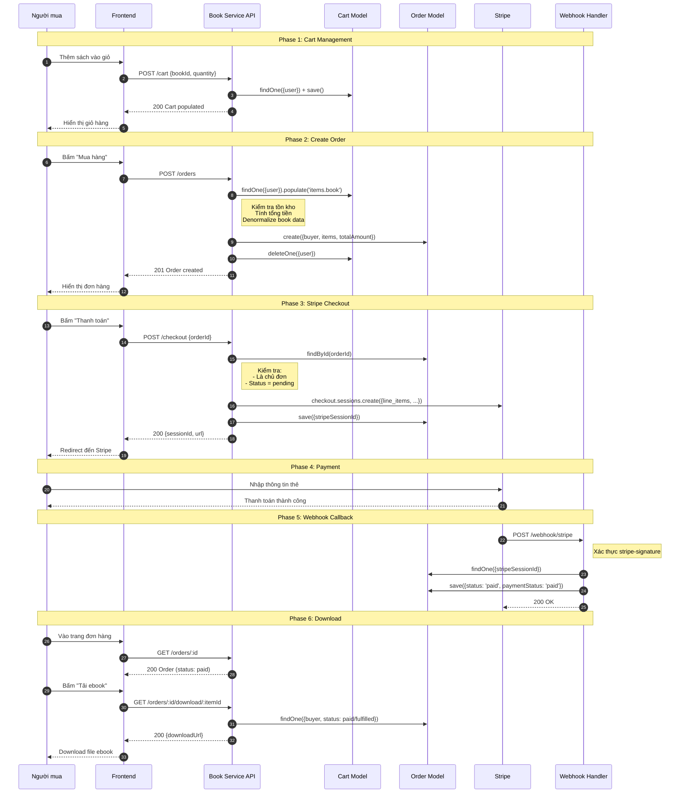
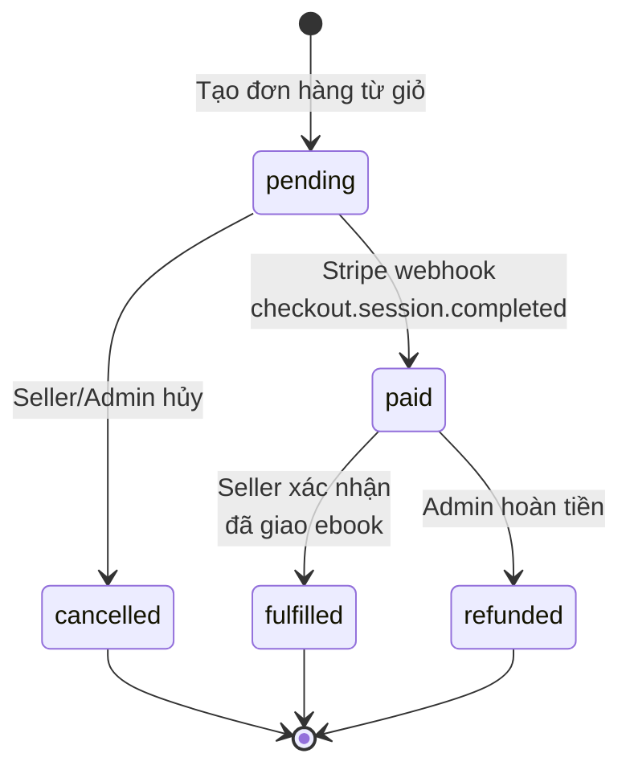
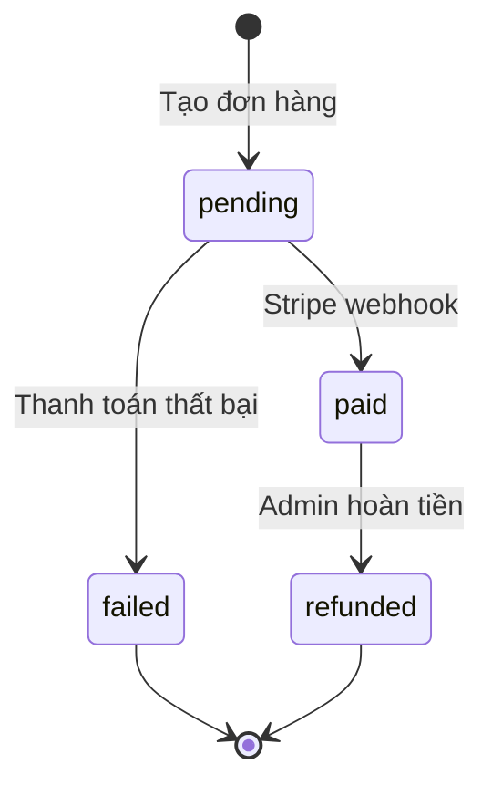

# Book Store Service — Sequence Diagram: Checkout Flow

> **Môn học:** CT550 - Công nghệ phần mềm  
> **Ngày:** 2026-07-16

## Checkout Flow

Luồng thanh toán hoàn chỉnh từ khi người dùng thêm sách vào giỏ đến khi tải ebook.

---

## State Diagram: Order Status

---

## State Diagram: Payment Status

