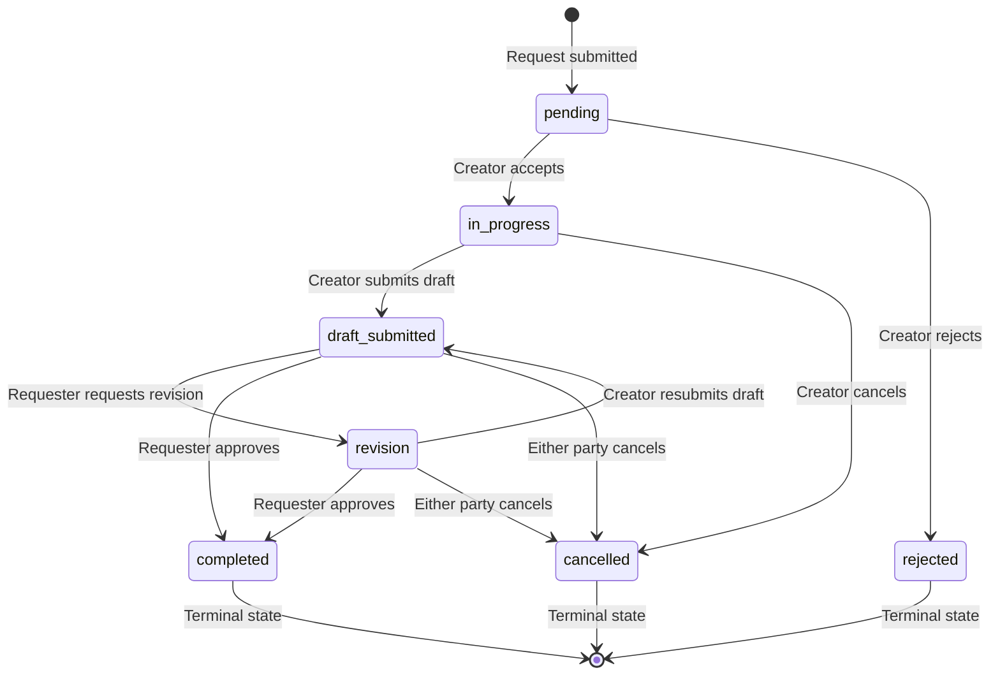

# Simplify Request State Machine — Merge Accept+Start, Remove Pending Cancel

> **For agentic workers:** REQUIRED SUB-SKILL: Use compose:subagent (recommended) or compose:execute to implement this plan task-by-task. Steps use checkbox (`- [ ]`) syntax for tracking.

**Goal:** Simplify the request state machine by merging Accept+Start into one step and removing Cancel from Pending state.

**Architecture:** Remove the `accepted` status entirely. `pending` transitions directly to `in_progress` on accept. Remove `cancelled` as a valid transition from `pending` (only `rejected` is allowed). All other transitions unchanged.

**Tech Stack:** Express 5, Mongoose, Vue 3, Pinia, Node.js built-in test runner

## Global Constraints

- Backend uses CommonJS (`require`/`module.exports`) — NOT ESM
- Tests use Node.js built-in test runner (`node:test` + `node:assert/strict`) — NOT Jest
- Run tests: `cd backend && npm test`

---

## New State Machine

```
Pending ──→ In Progress ──→ Draft Submitted ──→ Completed
   │              │              │
   └→ Rejected    └→ Cancelled  └→ Revision ──→ Draft Submitted
                                                └→ Completed
                                                └→ Cancelled
```

Removed: `accepted` status, `pending → cancelled` transition, `accepted → in_progress` transition, `accepted → cancelled` transition.

---

## File Map

| File | Change |
|------|--------|
| `backend/utils/requestValidation.js` | Remove `ACCEPTED` status, update `TRANSITIONS`, update `ACTIVE_REQUEST_STATUSES` |
| `backend/controllers/request.controller.js` | Merge `acceptRequest` to go directly to `in_progress`, delete `startRequest` |
| `backend/routes/request.routes.js` | Remove `start` route and import |
| `backend/tests/requestValidation.test.js` | Update transition tests |
| `frontend/src/services/api.js` | Remove `start` from `requestApi` |
| `frontend/src/stores/request.store.js` | Remove `start` from actionMap |
| `frontend/src/components/request/RequestListSection.vue` | Remove Start button, keep only Accept for pending |
| `docs/action-flow/request-action-flows.md` | Update state machine docs |

---

### Task 1: Update backend validation — remove `accepted` status

**Files:**
- Modify: `backend/utils/requestValidation.js:5-50`

- [ ] **Step 1: Update `REQUEST_STATUSES` — remove `ACCEPTED`**

In `requestValidation.js`, change:

```js
const REQUEST_STATUSES = {
    PENDING: 'pending',
    ACCEPTED: 'accepted',
    IN_PROGRESS: 'in_progress',
    DRAFT_SUBMITTED: 'draft_submitted',
    REVISION: 'revision',
    COMPLETED: 'completed',
    REJECTED: 'rejected',
    CANCELLED: 'cancelled',
};
```

to:

```js
const REQUEST_STATUSES = {
    PENDING: 'pending',
    IN_PROGRESS: 'in_progress',
    DRAFT_SUBMITTED: 'draft_submitted',
    REVISION: 'revision',
    COMPLETED: 'completed',
    REJECTED: 'rejected',
    CANCELLED: 'cancelled',
};
```

- [ ] **Step 2: Update `ACTIVE_REQUEST_STATUSES` — remove `ACCEPTED`**

Change:

```js
const ACTIVE_REQUEST_STATUSES = [
    REQUEST_STATUSES.ACCEPTED,
    REQUEST_STATUSES.IN_PROGRESS,
    REQUEST_STATUSES.DRAFT_SUBMITTED,
    REQUEST_STATUSES.REVISION,
];
```

to:

```js
const ACTIVE_REQUEST_STATUSES = [
    REQUEST_STATUSES.IN_PROGRESS,
    REQUEST_STATUSES.DRAFT_SUBMITTED,
    REQUEST_STATUSES.REVISION,
];
```

- [ ] **Step 3: Update `TRANSITIONS` — merge pending→in_progress, remove accepted, remove pending→cancelled**

Change the entire `TRANSITIONS` block from:

```js
const TRANSITIONS = {
    [REQUEST_STATUSES.PENDING]: [
        REQUEST_STATUSES.ACCEPTED,
        REQUEST_STATUSES.REJECTED,
        REQUEST_STATUSES.CANCELLED,
    ],
    [REQUEST_STATUSES.ACCEPTED]: [
        REQUEST_STATUSES.IN_PROGRESS,
        REQUEST_STATUSES.CANCELLED,
    ],
    [REQUEST_STATUSES.IN_PROGRESS]: [
        REQUEST_STATUSES.DRAFT_SUBMITTED,
        REQUEST_STATUSES.CANCELLED,
    ],
    [REQUEST_STATUSES.DRAFT_SUBMITTED]: [
        REQUEST_STATUSES.REVISION,
        REQUEST_STATUSES.COMPLETED,
        REQUEST_STATUSES.CANCELLED,
    ],
    [REQUEST_STATUSES.REVISION]: [
        REQUEST_STATUSES.DRAFT_SUBMITTED,
        REQUEST_STATUSES.COMPLETED,
        REQUEST_STATUSES.CANCELLED,
    ],
    [REQUEST_STATUSES.COMPLETED]: [],
    [REQUEST_STATUSES.REJECTED]: [],
    [REQUEST_STATUSES.CANCELLED]: [],
};
```

to:

```js
const TRANSITIONS = {
    [REQUEST_STATUSES.PENDING]: [
        REQUEST_STATUSES.IN_PROGRESS,
        REQUEST_STATUSES.REJECTED,
    ],
    [REQUEST_STATUSES.IN_PROGRESS]: [
        REQUEST_STATUSES.DRAFT_SUBMITTED,
        REQUEST_STATUSES.CANCELLED,
    ],
    [REQUEST_STATUSES.DRAFT_SUBMITTED]: [
        REQUEST_STATUSES.REVISION,
        REQUEST_STATUSES.COMPLETED,
        REQUEST_STATUSES.CANCELLED,
    ],
    [REQUEST_STATUSES.REVISION]: [
        REQUEST_STATUSES.DRAFT_SUBMITTED,
        REQUEST_STATUSES.COMPLETED,
        REQUEST_STATUSES.CANCELLED,
    ],
    [REQUEST_STATUSES.COMPLETED]: [],
    [REQUEST_STATUSES.REJECTED]: [],
    [REQUEST_STATUSES.CANCELLED]: [],
};
```

- [ ] **Step 4: Run tests — expect failures (tests reference ACCEPTED)**

Run: `cd backend && npm test`
Expected: FAIL — tests reference `REQUEST_STATUSES.ACCEPTED` which no longer exists.

- [ ] **Step 5: Commit**

```bash
git add backend/utils/requestValidation.js
git commit -m "refactor: remove accepted status, merge pending->in_progress"
```

---

### Task 2: Update backend controller — merge accept into in_progress

**Files:**
- Modify: `backend/controllers/request.controller.js:394-461`

- [ ] **Step 1: Update `acceptRequest` to transition directly to `in_progress`**

In `request.controller.js`, replace the `acceptRequest` function (lines 394-419):

```js
const acceptRequest = async (req, res, next) => {
    try {
        const request = await findRequestOrFail(req.params.id);
        authorizeOrFail(ensureCreator(request, req.user._id), 'Only the creator can accept this request');

        request.dueAt = new Date(Date.now() + 60 * 24 * 60 * 60 * 1000);
        await transitionRequest({
            request,
            actorId: req.user._id,
            toStatus: REQUEST_STATUSES.ACCEPTED,
            type: 'request_accepted',
        });
        await addSystemChat(request._id, req.user._id, 'Private request room opened after creator acceptance.');
        await createNotification({
            userId: request.requester,
            actorId: req.user._id,
            type: 'request',
            message: `Your Request "${request.title}" was accepted.`,
        });

        const populated = await populateRequest(Request.findById(request._id));
        res.json(populated);
    } catch (error) {
        next(error);
    }
};
```

with:

```js
const acceptRequest = async (req, res, next) => {
    try {
        const request = await findRequestOrFail(req.params.id);
        authorizeOrFail(ensureCreator(request, req.user._id), 'Only the creator can accept this request');

        request.dueAt = new Date(Date.now() + 60 * 24 * 60 * 60 * 1000);
        await transitionRequest({
            request,
            actorId: req.user._id,
            toStatus: REQUEST_STATUSES.IN_PROGRESS,
            type: 'request_accepted',
        });
        await addSystemChat(request._id, req.user._id, 'Private request room opened. Work has begun.');
        await createNotification({
            userId: request.requester,
            actorId: req.user._id,
            type: 'request',
            message: `Your Request "${request.title}" was accepted and is now in progress.`,
        });

        const populated = await populateRequest(Request.findById(request._id));
        res.json(populated);
    } catch (error) {
        next(error);
    }
};
```

- [ ] **Step 2: Delete `startRequest` function entirely**

Delete lines 445-461 (the entire `startRequest` function):

```js
const startRequest = async (req, res, next) => {
    try {
        const request = await findRequestOrFail(req.params.id);
        authorizeOrFail(ensureCreator(request, req.user._id), 'Only the creator can start this request');

        await transitionRequest({
            request,
            actorId: req.user._id,
            toStatus: REQUEST_STATUSES.IN_PROGRESS,
            type: 'request_started',
        });

        res.json(await populateRequest(Request.findById(request._id)));
    } catch (error) {
        next(error);
    }
};
```

- [ ] **Step 3: Remove `startRequest` from module.exports**

In the `module.exports` block at the bottom of the file, remove `startRequest` from the exports list.

- [ ] **Step 4: Commit**

```bash
git add backend/controllers/request.controller.js
git commit -m "refactor: acceptRequest goes directly to in_progress, remove startRequest"
```

---

### Task 3: Update backend routes — remove start endpoint

**Files:**
- Modify: `backend/routes/request.routes.js:23,94`

- [ ] **Step 1: Remove `startRequest` import**

In `request.routes.js`, remove `startRequest` from the destructured import on line 23.

- [ ] **Step 2: Remove the start route**

Delete line 94:
```js
router.post('/:id/start', protect, startRequest);
```

- [ ] **Step 3: Run tests — expect failure (test references ACCEPTED)**

Run: `cd backend && npm test`
Expected: FAIL — test file still references `REQUEST_STATUSES.ACCEPTED`.

- [ ] **Step 4: Commit**

```bash
git add backend/routes/request.routes.js
git commit -m "refactor: remove /start route"
```

---

### Task 4: Update tests

**Files:**
- Modify: `backend/tests/requestValidation.test.js:46-52`

- [ ] **Step 1: Update transition test**

Replace the test at line 46:

```js
test('allows only explicit request status transitions', () => {
    assert.equal(canTransitionRequest(REQUEST_STATUSES.PENDING, REQUEST_STATUSES.ACCEPTED), true);
    assert.equal(canTransitionRequest(REQUEST_STATUSES.ACCEPTED, REQUEST_STATUSES.IN_PROGRESS), true);
    assert.equal(canTransitionRequest(REQUEST_STATUSES.DRAFT_SUBMITTED, REQUEST_STATUSES.REVISION), true);
    assert.equal(canTransitionRequest(REQUEST_STATUSES.COMPLETED, REQUEST_STATUSES.REVISION), false);
    assert.equal(canTransitionRequest(REQUEST_STATUSES.REJECTED, REQUEST_STATUSES.ACCEPTED), false);
});
```

with:

```js
test('allows only explicit request status transitions', () => {
    assert.equal(canTransitionRequest(REQUEST_STATUSES.PENDING, REQUEST_STATUSES.IN_PROGRESS), true);
    assert.equal(canTransitionRequest(REQUEST_STATUSES.PENDING, REQUEST_STATUSES.REJECTED), true);
    assert.equal(canTransitionRequest(REQUEST_STATUSES.PENDING, REQUEST_STATUSES.CANCELLED), false);
    assert.equal(canTransitionRequest(REQUEST_STATUSES.DRAFT_SUBMITTED, REQUEST_STATUSES.REVISION), true);
    assert.equal(canTransitionRequest(REQUEST_STATUSES.COMPLETED, REQUEST_STATUSES.REVISION), false);
    assert.equal(canTransitionRequest(REQUEST_STATUSES.REJECTED, REQUEST_STATUSES.IN_PROGRESS), false);
});
```

- [ ] **Step 2: Run tests — expect PASS**

Run: `cd backend && npm test`
Expected: All tests pass.

- [ ] **Step 3: Commit**

```bash
git add backend/tests/requestValidation.test.js
git commit -m "test: update transition tests for simplified state machine"
```

---

### Task 5: Update frontend — remove start API and button

**Files:**
- Modify: `frontend/src/services/api.js:223`
- Modify: `frontend/src/stores/request.store.js:107`
- Modify: `frontend/src/components/request/RequestListSection.vue:56`

- [ ] **Step 1: Remove `start` from `requestApi`**

In `frontend/src/services/api.js`, delete line 223:
```js
  start: (requestId) => api.post(`/requests/${requestId}/start`),
```

- [ ] **Step 2: Remove `start` from store actionMap**

In `frontend/src/stores/request.store.js`, delete line 107:
```js
        start: () => requestApi.start(requestId),
```

- [ ] **Step 3: Remove Start button from RequestListSection**

In `frontend/src/components/request/RequestListSection.vue`, delete line 56:
```html
          <button v-if="item.status === 'accepted'" type="button" @click.stop="emit('action', item._id, 'start')">Start</button>
```

- [ ] **Step 4: Run build — expect PASS**

Run: `cd frontend && npm run build`
Expected: Build succeeds.

- [ ] **Step 5: Commit**

```bash
git add frontend/src/services/api.js frontend/src/stores/request.store.js frontend/src/components/request/RequestListSection.vue
git commit -m "refactor: remove start action from frontend"
```

---

### Task 6: Update documentation

**Files:**
- Modify: `docs/action-flow/request-action-flows.md:20-80`

- [ ] **Step 1: Update state machine diagram**

Replace the mermaid diagram (lines 20-45) with:



- [ ] **Step 2: Update states table**

Replace the states table (lines 49-62) — remove the `accepted` row and update active states:

```markdown
| Status | Description | Terminal | Active |
|--------|-------------|----------|--------|
| `pending` | Request submitted; awaiting creator decision | No | No |
| `in_progress` | Creator accepted and is actively working | No | **Yes** |
| `draft_submitted` | Creator submitted draft files; awaiting requester action | No | **Yes** |
| `revision` | Requester requested changes; creator reworking | No | **Yes** |
| `completed` | Final files delivered and/or approved; all done | **Yes** | No |
| `rejected` | Creator declined the request | **Yes** | No |
| `cancelled` | Either party terminated the request | **Yes** | No |

**Active states** are defined in `ACTIVE_REQUEST_STATUSES` and include `in_progress`, `draft_submitted`, and `revision`. These states count toward a creator's open request capacity.
```

- [ ] **Step 3: Update transitions table**

Replace the transitions table (lines 66-80) — merge accept+start, remove pending cancel:

```markdown
| From | To | Action | Performer | API Endpoint | Notes |
|------|----|--------|-----------|-------------|-------|
| `pending` | `in_progress` | accept | Creator | `POST /api/requests/:id/accept` | Sets `dueAt` to now + 60 days. Opens private chat room. Work begins immediately. |
| `pending` | `rejected` | reject | Creator | `POST /api/requests/:id/reject` | Optional reason in body. |
| `in_progress` | `draft_submitted` | submitDraft | Creator | `POST /api/requests/:id/draft` | Multipart. Requires `draftFiles`. Sets `autoCompleteAt` to now + 7 days. |
| `in_progress` | `cancelled` | cancel | Creator | `POST /api/requests/:id/cancel` | Only creator can cancel from in_progress. |
| `draft_submitted` | `revision` | createRevision | Requester | `POST /api/requests/:id/revisions` | Max 2 rounds. Requires `notes` in body. |
| `draft_submitted` | `completed` | approve | Requester | `POST /api/requests/:id/approve` | Closes chat. |
| `draft_submitted` | `cancelled` | cancel | Either participant | `POST /api/requests/:id/cancel` | Closes chat. |
| `revision` | `draft_submitted` | submitDraft | Creator | `POST /api/requests/:id/draft` | Same endpoint; re-enters draft_submitted state. |
| `revision` | `completed` | approve | Requester | `POST /api/requests/:id/approve` | Closes chat. |
| `revision` | `cancelled` | cancel | Either participant | `POST /api/requests/:id/cancel` | Closes chat. |
```

- [ ] **Step 4: Commit**

```bash
git add docs/action-flow/request-action-flows.md
git commit -m "docs: update state machine docs for simplified flow"
```
