```mermaid
erDiagram
  USER {
    ObjectId _id PK
    string email UK "unique login email"
    string username UK "unique display handle"
    string displayName
    string avatar
    string coverImage
    string bio
    string gender
    string location
    date birthday
    string occupation
    string website
    json socialLinks "embedded {x,facebook,instagram}"
    string role "user | admin"
    boolean aiDetectionEnabled
    string password "hashed"
    string googleId
    string facebookId
    string twitterId
  }

  FOLLOW {
    ObjectId _id PK
    ObjectId follower FK "ref User — who follows"
    ObjectId following FK "ref User — being followed"
  }

  USER_BLOCK {
    ObjectId _id PK
    ObjectId blocker FK "ref User"
    ObjectId blocked FK "ref User"
  }

  MESSAGE {
    ObjectId _id PK
    ObjectId sender FK "ref User"
    ObjectId recipient FK "ref User"
    string content
    array images
    boolean isRead
    datetime readAt
    array deletedFor "ref User[]"
  }

  NOTIFICATION {
    ObjectId _id PK
    ObjectId user FK "ref User — recipient"
    ObjectId actor FK "ref User — trigger"
    ObjectId artwork FK "ref Artwork — optional context"
    string type "follow|like|bookmark|comment|request|system"
    string message
    boolean isRead
    datetime readAt
  }

  ARTWORK {
    ObjectId _id PK
    ObjectId user FK "ref User — creator"
    string title
    string description
    string type "illust|manga|gif|novel"
    array images
    array tags "ref Tag[]"
    string ageRating "all|r-18|r-18g"
    number viewCount
    number likeCount
    number bookmarkCount
    number commentCount
    number reportCount
    json gifNotes
    string novelContent
    string novelFormat "oneshot|series"
    string novelSeriesName
    number chapterCount
    number wordCount
    boolean isHidden
    ObjectId hiddenBy FK "ref User — moderator"
    datetime hiddenAt
    string hiddenReason
  }

  TAG {
    ObjectId _id PK
    string name UK
    json translations "embedded {en,vi,ja}"
    number usageCount
    boolean isLocked
  }

  COMMENT {
    ObjectId _id PK
    ObjectId artwork FK "ref Artwork"
    ObjectId user FK "ref User — author"
    string content
    ObjectId parentComment FK "ref Comment — self for replies"
    string stickerUrl
  }

  LIKE {
    ObjectId _id PK
    ObjectId user FK "ref User"
    ObjectId artwork FK "ref Artwork"
  }

  BOOKMARK {
    ObjectId _id PK
    ObjectId user FK "ref User"
    ObjectId artwork FK "ref Artwork"
    string folder
  }

  CHAPTER {
    ObjectId _id PK
    ObjectId artwork FK "ref Artwork"
    string title
    string content
    number chapterNumber "unique per artwork"
    number wordCount
  }

  READING_PROGRESS {
    ObjectId _id PK
    ObjectId user FK "ref User"
    ObjectId artwork FK "ref Artwork"
    ObjectId chapter FK "ref Chapter"
    number progressPercent
    number scrollPosition
    datetime lastReadAt
  }

  ARTWORK_REPORT {
    ObjectId _id PK
    ObjectId artwork FK "ref Artwork"
    ObjectId reportedBy FK "ref User"
    string reason "spam|inappropriate|copyright|harassment|nsfw|other"
    string description
    string status "pending|resolved|dismissed"
    ObjectId resolvedBy FK "ref User"
    datetime resolvedAt
    string resolutionNote
  }

  REQUEST_TERM {
    ObjectId _id PK
    ObjectId creator FK "ref User"
    string title
    string tier
    number targetPrice
    string currency
    array acceptedWorkTypes
    number estimatedDays
    number maxOpenRequests
    array acceptedAgeRatings
    string rules
    array forbiddenTopics
    array preferredStyles
    array strengths
    json commercialUse "embedded {allowed,feeMultiplier,notes}"
    boolean isOpen
  }

  REQUEST {
    ObjectId _id PK
    ObjectId term FK "ref RequestTerm"
    ObjectId creator FK "ref User — provider"
    ObjectId requester FK "ref User — client"
    string title
    string description
    string workType
    array tags
    json specifics "embedded {pose,outfit,mood,lighting,angle,other}"
    number proposedAmount
    string currency
    string visibility
    boolean isAnonymous
    string ageRating
    string status "pending|accepted|in_progress|draft_submitted|revision|completed|rejected|cancelled"
    array referenceImages "embedded"
    array draftFiles "embedded"
    array finalFiles "embedded"
    array giftFiles "embedded"
    number revisionCount
    datetime autoCompleteAt
    datetime dueAt
    datetime extensionRequestedAt
    number extensionDays
    datetime chatClosedAt
    string licenseTier
  }

  REQUEST_CHAT_MESSAGE {
    ObjectId _id PK
    ObjectId request FK "ref Request"
    ObjectId sender FK "ref User"
    string content
    array attachments "embedded"
    boolean isSystem
  }

  REQUEST_EVENT {
    ObjectId _id PK
    ObjectId request FK "ref Request"
    ObjectId actor FK "ref User"
    string type
    string fromStatus
    string toStatus
    json metadata "Mixed"
  }

  REQUEST_REVISION {
    ObjectId _id PK
    ObjectId request FK "ref Request"
    ObjectId requester FK "ref User"
    number round "1|2 — unique per request"
    string notes
  }

  USER ||--o{ ARTWORK : "creates"
  USER ||--o{ COMMENT : "writes"
  USER ||--o{ LIKE : "gives"
  USER ||--o{ BOOKMARK : "creates"
  USER ||--o{ FOLLOW : "follows as follower"
  USER ||--o{ FOLLOW : "is followed as following"
  USER ||--o{ NOTIFICATION : "receives"
  USER ||--o{ NOTIFICATION : "triggers as actor"
  USER ||--o{ MESSAGE : "sends"
  USER ||--o{ MESSAGE : "receives"
  USER ||--o{ USER_BLOCK : "blocks as blocker"
  USER ||--o{ USER_BLOCK : "blocked as blocked"
  USER ||--o{ ARTWORK_REPORT : "reports"
  USER ||--o{ ARTWORK_REPORT : "resolves"
  USER ||--o{ ARTWORK : "hides as moderator"
  USER ||--o{ REQUEST_TERM : "creates"
  USER ||--o{ REQUEST : "is creator/provider"
  USER ||--o{ REQUEST : "is requester/client"
  USER ||--o{ REQUEST_CHAT_MESSAGE : "sends"
  USER ||--o{ REQUEST_EVENT : "acts"
  USER ||--o{ REQUEST_REVISION : "requests as requester"
  USER ||--o{ READING_PROGRESS : "tracks"
  ARTWORK ||--o{ COMMENT : "has"
  ARTWORK ||--o{ LIKE : "receives"
  ARTWORK ||--o{ BOOKMARK : "gets"
  ARTWORK ||--o{ NOTIFICATION : "triggers"
  ARTWORK ||--o{ ARTWORK_REPORT : "reported in"
  ARTWORK ||--o{ CHAPTER : "contains"
  ARTWORK ||--o{ READING_PROGRESS : "tracks"
  ARTWORK }o--o{ TAG : "tagged with"
  CHAPTER ||--o{ READING_PROGRESS : "tracks"
  REQUEST_TERM ||--o{ REQUEST : "defines"
  REQUEST ||--o{ REQUEST_CHAT_MESSAGE : "has"
  REQUEST ||--o{ REQUEST_EVENT : "logs"
  REQUEST ||--o{ REQUEST_REVISION : "requests"
```

# IlluWrl — Entity-Relationship Diagram

> **Generated:** 2026-06-10
> **Entities:** 18 Mongoose models across 5 domain groups
> **Description:** Comprehensive ERD of the IlluWrl (Pixiv-clone) data model

---

---
## Legend

### Entity Groups

| Group | Entities | Description |
|-------|----------|-------------|
| **Core User System** | USER, FOLLOW, USER_BLOCK, MESSAGE, NOTIFICATION | Identity, social graph, messaging, alerts |
| **Content System** | ARTWORK, TAG, COMMENT, LIKE, BOOKMARK, CHAPTER, READING_PROGRESS | Primary creative content and engagement |
| **Reporting & Moderation** | ARTWORK_REPORT | Content flagging and resolution |
| **Commission System** | REQUEST_TERM, REQUEST, REQUEST_CHAT_MESSAGE, REQUEST_EVENT, REQUEST_REVISION | Commission marketplace and state machine |

### Cardinality Notation

| Symbol | Meaning |
|--------|---------|
| `||--o{` | One to Zero-or-More (most common — parent to child) |
| `||--||` | One to One |
| `}o--||` | Zero-or-More to One (inverse) |
| `}o--o{` | Zero-or-More to Zero-or-More (many-to-many) |
| `||--o{` | One to One-or-More |

### Field Annotations

| Suffix | Meaning |
|--------|---------|
| `PK` | Primary Key (`_id`) |
| `UK` | Unique Key (unique index) |
| `FK` | Foreign Key (Mongoose `ref`) |

---
## Entity Summary

| # | Entity | Fields | Key Relationships | Group |
|---|--------|--------|-------------------|-------|
| 1 | **USER** | 19 | 22 relationships | Core User System |
| 2 | **FOLLOW** | 3 | 2 relationships | Core User System |
| 3 | **USER_BLOCK** | 3 | 2 relationships | Core User System |
| 4 | **MESSAGE** | 8 | 2 relationships | Core User System |
| 5 | **NOTIFICATION** | 8 | 3 relationships | Core User System |
| 6 | **ARTWORK** | 23 | 10 relationships | Content System |
| 7 | **TAG** | 5 | 1 relationships | Content System |
| 8 | **COMMENT** | 6 | 2 relationships | Content System |
| 9 | **LIKE** | 3 | 2 relationships | Content System |
| 10 | **BOOKMARK** | 4 | 2 relationships | Content System |
| 11 | **CHAPTER** | 6 | 2 relationships | Content System |
| 12 | **READING_PROGRESS** | 7 | 3 relationships | Content System |
| 13 | **ARTWORK_REPORT** | 9 | 3 relationships | Reporting & Moderation |
| 14 | **REQUEST_TERM** | 16 | 2 relationships | Commission System |
| 15 | **REQUEST** | 26 | 6 relationships | Commission System |
| 16 | **REQUEST_CHAT_MESSAGE** | 6 | 2 relationships | Commission System |
| 17 | **REQUEST_EVENT** | 7 | 2 relationships | Commission System |
| 18 | **REQUEST_REVISION** | 5 | 2 relationships | Commission System |

---
*Generated by `scripts/generate-erd.js` on 2026-06-10 — 18 entities, 35 relationships.*