```mermaid
erDiagram
  USER {
    ObjectId _id PK
    string email UK "unique login email"
    string username UK "unique display handle"
    string displayName
    string avatar
    string coverImage
    string bio
    string gender
    string location
    date birthday
    string website
    json socialLinks "embedded {x,facebook,instagram}"
    string role "user | admin"
    string password "hashed"
    string googleId
    string facebookId
    string twitterId
    datetime createdAt
    datetime updatedAt
  }

  FOLLOW {
    ObjectId _id PK
    ObjectId follower FK "ref User — who follows"
    ObjectId following FK "ref User — being followed"
    datetime createdAt
    datetime updatedAt
  }

  USER_BLOCK {
    ObjectId _id PK
    ObjectId blocker FK "ref User"
    ObjectId blocked FK "ref User"
    datetime createdAt
    datetime updatedAt
  }

  SETTING {
    string _id PK "singleton key: global"
    boolean aiDetectionEnabled
    number aiDetectionThreshold "0-100"
    datetime createdAt
    datetime updatedAt
  }

  MESSAGE {
    ObjectId _id PK
    ObjectId sender FK "ref User"
    ObjectId recipient FK "ref User"
    string content
    array images
    boolean isRead
    datetime readAt
    array deletedFor "ref User[]"
    datetime createdAt
    datetime updatedAt
  }

  NOTIFICATION {
    ObjectId _id PK
    ObjectId user FK "ref User — recipient"
    ObjectId actor FK "ref User — trigger"
    ObjectId artwork FK "ref Artwork — optional context"
    string type "follow|like|bookmark|comment|request|system"
    string message
    boolean isRead
    datetime createdAt
    datetime updatedAt
  }

  ARTWORK {
    ObjectId _id PK
    ObjectId user FK "ref User — creator"
    string title
    string description
    string type "illust|manga|gif|novel"
    array images
    array tags "ref Tag[]"
    string ageRating "all|r-18"
    number viewCount
    number likeCount
    number bookmarkCount
    number commentCount
    number reportCount
    string novelContent
    number chapterCount
    number wordCount
    ObjectId series FK "ref Series — optional"
    boolean commentsEnabled
    boolean isHidden
    ObjectId hiddenBy FK "ref User — moderator"
    datetime hiddenAt
    string hiddenReason
    datetime createdAt
    datetime updatedAt
  }

  TAG {
    ObjectId _id PK
    string name UK
    json translations "embedded {en,vi,ja}"
    number usageCount
    datetime createdAt
    datetime updatedAt
  }

  COMMENT {
    ObjectId _id PK
    ObjectId artwork FK "ref Artwork"
    ObjectId user FK "ref User — author"
    string content
    ObjectId parentComment FK "ref Comment — self for replies"
    string emoji
    datetime createdAt
    datetime updatedAt
  }

  LIKE {
    ObjectId _id PK
    ObjectId user FK "ref User"
    ObjectId artwork FK "ref Artwork"
    datetime createdAt
    datetime updatedAt
  }

  BOOKMARK {
    ObjectId _id PK
    ObjectId user FK "ref User"
    ObjectId artwork FK "ref Artwork"
    string folder
    datetime createdAt
    datetime updatedAt
  }

  CHAPTER {
    ObjectId _id PK
    ObjectId artwork FK "ref Artwork"
    string title
    string content
    number chapterNumber "unique per artwork"
    number wordCount
    datetime createdAt
    datetime updatedAt
  }

  READING_PROGRESS {
    ObjectId _id PK
    ObjectId user FK "ref User"
    ObjectId artwork FK "ref Artwork"
    ObjectId chapter FK "ref Chapter"
    number progressPercent
    number scrollPosition
    datetime lastReadAt
    datetime createdAt
    datetime updatedAt
  }

  SERIES {
    ObjectId _id PK
    ObjectId user FK "ref User — owner"
    string title
    string description
    string type "manga|novel|illust"
    string coverImage
    ObjectId novelArtwork FK "ref Artwork — for novel series"
    array artworks "ref Artwork[] — ordered list"
    number artworkCount
    number totalViews
    number totalLikes
    boolean isCompleted
    array tags "ref Tag[]"
    datetime createdAt
    datetime updatedAt
  }

  BROWSE_HISTORY {
    ObjectId _id PK
    ObjectId user FK "ref User"
    ObjectId artwork FK "ref Artwork"
    datetime createdAt
    datetime updatedAt
  }

  BANNER {
    ObjectId _id PK
    string image
    string link
    string title
    string type "home|illust|manga|gif|novel"
    boolean isActive
    number sortOrder
    datetime createdAt
    datetime updatedAt
  }

  CHAT_SESSION {
    ObjectId _id PK
    ObjectId user FK "ref User"
    string title
    datetime createdAt
    datetime updatedAt
  }

  CHAT_MESSAGE {
    ObjectId _id PK
    ObjectId session FK "ref ChatSession"
    string role "user|assistant|system"
    string content
    boolean toolUsed
    boolean isError
    boolean isWelcome
    datetime createdAt
  }

  ARTWORK_REPORT {
    ObjectId _id PK
    ObjectId artwork FK "ref Artwork"
    ObjectId reportedBy FK "ref User"
    string reason "spam|inappropriate|copyright|harassment|nsfw|other"
    string description
    string status "pending|resolved|dismissed"
    ObjectId resolvedBy FK "ref User"
    datetime resolvedAt
    string resolutionNote
    datetime createdAt
    datetime updatedAt
  }

  USER_REPORT {
    ObjectId _id PK
    ObjectId reportedUser FK "ref User"
    ObjectId reportedBy FK "ref User"
    string reason "spam|inappropriate|harassment|impersonation|other"
    string description
    string status "pending|resolved|dismissed"
    ObjectId resolvedBy FK "ref User"
    datetime resolvedAt
    string resolutionNote
    datetime createdAt
    datetime updatedAt
  }

  COMMENT_REPORT {
    ObjectId _id PK
    ObjectId comment FK "ref Comment"
    ObjectId reportedBy FK "ref User"
    string reason "spam|inappropriate|harassment|other"
    string description
    string status "pending|resolved|dismissed"
    ObjectId resolvedBy FK "ref User"
    datetime resolvedAt
    string resolutionNote
    datetime createdAt
    datetime updatedAt
  }

  REQUEST_TERM {
    ObjectId _id PK
    ObjectId creator FK "ref User"
    string title
    string tier
    number targetPrice
    string currency
    array acceptedWorkTypes
    number estimatedDays
    number maxOpenRequests
    array acceptedAgeRatings
    string rules
    array forbiddenTopics
    array preferredStyles
    string strengths
    json commercialUse "embedded {allowed,feeMultiplier,notes}"
    boolean isOpen
    datetime createdAt
    datetime updatedAt
  }

  REQUEST {
    ObjectId _id PK
    ObjectId term FK "ref RequestTerm"
    ObjectId creator FK "ref User — provider"
    ObjectId requester FK "ref User — client"
    string title
    string description
    string workType
    array tags
    json specifics "embedded {pose,outfit,mood,lighting,angle,other}"
    number proposedAmount
    string currency
    string visibility
    boolean isAnonymous
    string ageRating
    string status "pending|in_progress|draft_submitted|revision|completed|rejected|cancelled"
    array referenceImages "embedded"
    array draftFiles "embedded"
    array finalFiles "embedded"
    array giftFiles "embedded"
    number revisionCount
    datetime autoCompleteAt
    datetime dueAt
    datetime extensionRequestedAt
    number extensionDays
    datetime chatClosedAt
    string licenseTier
    datetime createdAt
    datetime updatedAt
  }

  REQUEST_CHAT_MESSAGE {
    ObjectId _id PK
    ObjectId request FK "ref Request"
    ObjectId sender FK "ref User"
    string content
    array attachments "embedded"
    boolean isSystem
    datetime createdAt
    datetime updatedAt
  }

  REQUEST_EVENT {
    ObjectId _id PK
    ObjectId request FK "ref Request"
    ObjectId actor FK "ref User"
    string type
    string fromStatus
    string toStatus
    json metadata "Mixed"
    datetime createdAt
    datetime updatedAt
  }

  REQUEST_REVISION {
    ObjectId _id PK
    ObjectId request FK "ref Request"
    ObjectId requester FK "ref User"
    number round "1|2 — unique per request"
    string notes
    datetime createdAt
    datetime updatedAt
  }

  USER ||--o{ ARTWORK : "creates"
  USER ||--o{ COMMENT : "writes"
  USER ||--o{ LIKE : "gives"
  USER ||--o{ BOOKMARK : "creates"
  USER ||--o{ FOLLOW : "follows as follower"
  USER ||--o{ FOLLOW : "is followed as following"
  USER ||--o{ NOTIFICATION : "receives"
  USER ||--o{ NOTIFICATION : "triggers as actor"
  USER ||--o{ MESSAGE : "sends"
  USER ||--o{ MESSAGE : "receives"
  USER ||--o{ USER_BLOCK : "blocks as blocker"
  USER ||--o{ USER_BLOCK : "blocked as blocked"
  USER ||--o{ ARTWORK_REPORT : "reports"
  USER ||--o{ ARTWORK_REPORT : "resolves"
  USER ||--o{ USER_REPORT : "reports"
  USER ||--o{ USER_REPORT : "resolves"
  USER ||--o{ COMMENT_REPORT : "reports"
  USER ||--o{ COMMENT_REPORT : "resolves"
  USER ||--o{ ARTWORK : "hides as moderator"
  USER ||--o{ REQUEST_TERM : "creates"
  USER ||--o{ REQUEST : "is creator/provider"
  USER ||--o{ REQUEST : "is requester/client"
  USER ||--o{ REQUEST_CHAT_MESSAGE : "sends"
  USER ||--o{ REQUEST_EVENT : "acts"
  USER ||--o{ REQUEST_REVISION : "requests as requester"
  USER ||--o{ READING_PROGRESS : "tracks"
  USER ||--o{ SERIES : "creates"
  USER ||--o{ BROWSE_HISTORY : "browses"
  USER ||--o{ CHAT_SESSION : "owns"
  ARTWORK ||--o{ COMMENT : "has"
  ARTWORK ||--o{ LIKE : "receives"
  ARTWORK ||--o{ BOOKMARK : "gets"
  ARTWORK ||--o{ NOTIFICATION : "triggers"
  ARTWORK ||--o{ ARTWORK_REPORT : "reported in"
  ARTWORK ||--o{ CHAPTER : "contains"
  ARTWORK ||--o{ READING_PROGRESS : "tracks"
  ARTWORK }o--o{ TAG : "tagged with"
  ARTWORK }o--o{ SERIES : "belongs to"
  CHAPTER ||--o{ READING_PROGRESS : "tracks"
  SERIES ||--o{ ARTWORK : "contains"
  SERIES }o--o{ TAG : "tagged with"
  COMMENT ||--o{ COMMENT_REPORT : "reported in"
  BROWSE_HISTORY }o--|| ARTWORK : "views"
  CHAT_SESSION ||--o{ CHAT_MESSAGE : "contains"
  REQUEST_TERM ||--o{ REQUEST : "defines"
  REQUEST ||--o{ REQUEST_CHAT_MESSAGE : "has"
  REQUEST ||--o{ REQUEST_EVENT : "logs"
  REQUEST ||--o{ REQUEST_REVISION : "requests"
```

# IlluWrl — Entity-Relationship Diagram

> **Cập nhật:** 2026-07-09
> **Entities:** 26 Mongoose models across 6 domain groups
> **Description:** Comprehensive ERD of the IlluWrl (Pixiv-clone) data model

---

---

## Legend

### Entity Groups

| Group | Entities | Description |
|-------|----------|-------------|
| **Core User System** | USER, FOLLOW, USER_BLOCK, MESSAGE, NOTIFICATION, BROWSE_HISTORY | Identity, social graph, messaging, alerts, behavior tracking |
| **Content System** | ARTWORK, TAG, COMMENT, LIKE, BOOKMARK, CHAPTER, READING_PROGRESS, SERIES | Primary creative content, series management, and engagement |
| **AI System** | CHAT_SESSION, CHAT_MESSAGE | AI chatbot sessions and message history |
| **Reporting & Moderation** | ARTWORK_REPORT, USER_REPORT, COMMENT_REPORT | Content and user flagging and resolution |
| **Commission System** | REQUEST_TERM, REQUEST, REQUEST_CHAT_MESSAGE, REQUEST_EVENT, REQUEST_REVISION | Commission marketplace and state machine |
| **System Config** | SETTING, BANNER | Singleton global configuration, homepage banners |

### Cardinality Notation

| Symbol | Meaning |
|--------|---------|
| `\|\|--o{` | One to Zero-or-More (most common — parent to child) |
| `\|\|--||` | One to One |
| `}o--||` | Zero-or-More to One (inverse) |
| `}o--o{` | Zero-or-More to Zero-or-More (many-to-many) |
| `\|\|--o{` | One to One-or-More |

### Field Annotations

| Suffix | Meaning |
|--------|---------|
| `PK` | Primary Key (`_id`) |
| `UK` | Unique Key (unique index) |
| `FK` | Foreign Key (Mongoose `ref`) |

---

## Entity Summary

| # | Entity | Fields | Key Relationships | Group |
|---|--------|--------|-------------------|-------|
| 1 | **USER** | 19 | 24 relationships | Core User System |
| 2 | **FOLLOW** | 5 | 2 relationships | Core User System |
| 3 | **USER_BLOCK** | 5 | 2 relationships | Core User System |
| 4 | **SETTING** | 5 | 0 relationships | System Config |
| 5 | **MESSAGE** | 10 | 2 relationships | Core User System |
| 6 | **NOTIFICATION** | 9 | 3 relationships | Core User System |
| 7 | **ARTWORK** | 24 | 11 relationships | Content System |
| 8 | **TAG** | 6 | 2 relationships | Content System |
| 9 | **COMMENT** | 8 | 2 relationships | Content System |
| 10 | **LIKE** | 5 | 2 relationships | Content System |
| 11 | **BOOKMARK** | 6 | 2 relationships | Content System |
| 12 | **CHAPTER** | 8 | 2 relationships | Content System |
| 13 | **READING_PROGRESS** | 9 | 3 relationships | Content System |
| 14 | **SERIES** | 16 | 4 relationships | Content System |
| 15 | **BROWSE_HISTORY** | 5 | 2 relationships | Core User System |
| 16 | **BANNER** | 8 | 0 relationships | System Config |
| 17 | **CHAT_SESSION** | 5 | 2 relationships | AI System |
| 18 | **CHAT_MESSAGE** | 8 | 1 relationships | AI System |
| 19 | **ARTWORK_REPORT** | 11 | 3 relationships | Reporting & Moderation |
| 20 | **USER_REPORT** | 11 | 3 relationships | Reporting & Moderation |
| 21 | **COMMENT_REPORT** | 11 | 3 relationships | Reporting & Moderation |
| 22 | **REQUEST_TERM** | 18 | 2 relationships | Commission System |
| 23 | **REQUEST** | 28 | 6 relationships | Commission System |
| 24 | **REQUEST_CHAT_MESSAGE** | 8 | 2 relationships | Commission System |
| 25 | **REQUEST_EVENT** | 9 | 2 relationships | Commission System |
| 26 | **REQUEST_REVISION** | 7 | 2 relationships | Commission System |

---

## Key Changes from Previous Version

| Change | Details |
|--------|---------|
| **SERIES (new)** | Dedicated entity for managing series (manga/novel/illust). Replaces `novelFormat`/`novelSeriesName` fields in Artwork. Artwork now has `series` FK ref. |
| **CHAT_SESSION / CHAT_MESSAGE (new)** | AI chatbot session tracking and message history. |
| **BANNER (new)** | Homepage and category-specific banners. |
| **BROWSE_HISTORY (new)** | User browse history for AI-powered recommendations. |
| **USER_REPORT / COMMENT_REPORT (new)** | Separate report entities for users and comments (ArtworkReport existed before). |
| **ARTWORK updated** | Removed `novelFormat`, `novelSeriesName`. Added `series` (FK ref to Series), `commentsEnabled`. |
| **REQUEST simplified** | Removed `accepted` status — pending transitions directly to in_progress. |

---

*Last updated: 2026-07-09 — 26 entities, 45+ relationships.*
