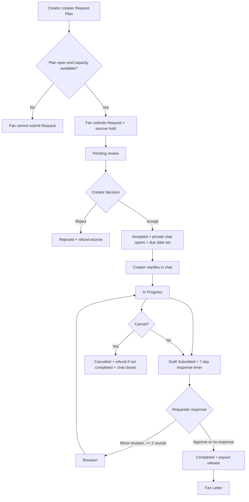

# Request Feature PRD

## 1. Product Requirements Document

### Summary

`Request` is a commission-style workflow that lets fans pay creators to produce a work such as illustration, manga, gif, or novel content. The platform holds the payment in escrow while the creator decides whether to accept. Co-request is intentionally excluded.

### Goals

- Let creators publish one or more Request Plans with price, accepted work types, delivery window, rules, capacity, and style strengths.
- Let fans submit detailed requests with Markdown-friendly description, tags, creative specifics, proposed amount, privacy, anonymous mode, and up to 15 reference files.
- Open a private two-party request room after creator acceptance.
- Support a fair lifecycle: `Pending -> Accepted -> In Progress -> Draft Submitted -> Revision -> Completed`, plus `Rejected` and `Cancelled`.
- Limit requester revision rounds to 2 minor revisions after draft submission.
- Keep audit logs for lifecycle actions, chat, files, reports, and dispute review.
- Respect R-18/R-18G boundaries and default non-commercial usage unless a commercial plan is created.

### Non-Goals

- No co-request / 相乗り.
- No real payment processor integration in this implementation. Escrow is represented as auditable ledger fields and can be connected to a provider later.
- No real push/email provider in this implementation. Existing in-app notifications are emitted; provider adapters can subscribe to request events.

### Core User Stories

- As a creator, I can create multiple request plans such as Basic, Premium, and Commercial Use.
- As a fan, I can see whether a creator is accepting requests from their profile and submit a request only when a plan is open.
- As a creator, I can accept, reject, start, cancel, submit drafts, complete, and request one delivery extension.
- As a requester, I can ask for up to 2 minor revisions after a draft and send a fan letter after completion.
- As moderation, I can inspect event logs, chat history, and uploaded files for disputes.

### Acceptance Criteria

- A creator must have at least one open `RequestTerm` before fans can submit.
- Proposed amount must be greater than or equal to the selected plan target price.
- Active accepted/in-progress/draft/revision requests count against creator capacity.
- Acceptance sets a 60-day due date and opens private chat.
- One extension may add at most 30 days.
- Completing or cancelling closes chat.
- Completion releases escrow minus a platform fee rate, currently modeled at 12%.
- Requester non-response can be automated by a scheduler using `autoCompleteAt` after draft submission.

## 2. User Flow Diagram

## 3. Database Schema

### RequestTerm

- `creator`: User reference.
- `title`, `tier`: plan naming.
- `targetPrice`, `currency`.
- `acceptedWorkTypes`: `illust | manga | gif | novel`.
- `estimatedDays`: 14 to 60.
- `maxOpenRequests`: capacity cap.
- `acceptedAgeRatings`: `all | r-18 | r-18g`.
- `rules`, `forbiddenTopics`, `preferredStyles`, `strengths`.
- `commercialUse`: `{ allowed, feeMultiplier, notes }`.
- `isOpen`, timestamps.

### Request

- `term`, `creator`, `requester`.
- `title`, `description`, `workType`, `tags`, `specifics`.
- `proposedAmount`, `currency`, `visibility`, `isAnonymous`, `ageRating`.
- `status`: `pending`, `accepted`, `in_progress`, `draft_submitted`, `revision`, `completed`, `rejected`, `cancelled`.
- `referenceImages`, `draftFiles`, `finalFiles`, `giftFiles`.
- `revisionCount`, `dueAt`, `extensionRequestedAt`, `extensionDays`, `autoCompleteAt`, `chatClosedAt`.
- `escrow`: `status`, `platformFeeRate`, `platformFeeAmount`, `creatorPayoutAmount`, release/refund dates.
- `fanLetter`: rating, message, date.

### RequestChatMessage

- `request`, `sender`, `content`, `attachments`, `isSystem`, timestamps.

### RequestRevision

- `request`, `requester`, `round`, `notes`, `status`, `addressedAt`, timestamps.

### RequestEvent

- `request`, `actor`, `type`, `fromStatus`, `toStatus`, `metadata`, timestamps.

## 4. API Endpoints

All write endpoints require `Authorization: Bearer <token>`.

- `GET /api/requests/terms?creator=:id&openOnly=true|false`
- `POST /api/requests/terms`
- `PATCH /api/requests/terms/:id`
- `POST /api/requests` multipart with `referenceImages[]`
- `GET /api/requests/mine?role=creator|requester&status=...`
- `GET /api/requests/public?creator=:id`
- `GET /api/requests/:id`
- `POST /api/requests/:id/accept`
- `POST /api/requests/:id/reject`
- `POST /api/requests/:id/start`
- `POST /api/requests/:id/cancel`
- `POST /api/requests/:id/extension`
- `POST /api/requests/:id/draft` multipart with `draftFiles[]`
- `POST /api/requests/:id/revisions`
- `POST /api/requests/:id/complete` multipart with `finalFiles[]`, `giftFiles[]`
- `POST /api/requests/:id/approve`
- `POST /api/requests/:id/fan-letter`
- `GET /api/requests/:id/chat`
- `POST /api/requests/:id/chat` multipart with `attachments[]`
- `GET /api/requests/:id/events`
- `POST /api/requests/:id/report`

## 5. UI/UX Notes

- Creator profile shows an `Accepting Requests` badge when at least one plan is open.
- Profile `Requests` tab lists plans, target price, accepted work types, delivery days, capacity, rules, and strengths.
- Fan submission form is mobile-first, defaults to Private, supports anonymous mode, and groups specifics into pose, outfit, mood, lighting, and angle fields.
- Creator management lives at `/requests/manage` with a compact plan form, queue filters, status badges, and primary lifecycle actions.
- Chat should be treated as the operational source of truth after acceptance; future UI should place draft, revision, and final delivery controls inside the request detail/chat page.
- R-18/R-18G choices are explicit in plan and request forms so moderation can enforce creator preference and platform policy.

## 6. Payment Expansion

Detailed escrow/payment design, schemas, endpoints, security notes, and checkout/payout UI guidance are maintained in `docs/request-payment-prd.md`.
