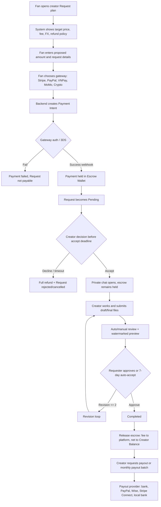

# Request Payment Integration PRD

## 1. PRD Payment Section

### Mục tiêu

Tích hợp thanh toán an toàn cho Request theo mô hình escrow: Requester thanh toán trước, nền tảng giữ tiền trong virtual escrow wallet, Creator chỉ nhận payout sau khi request hoàn tất, qua review, và hết điều kiện dispute. Hệ thống ưu tiên Việt Nam, Nhật Bản, và thị trường quốc tế.

### Nguyên tắc sản phẩm

- Minh bạch trước checkout: hiển thị target price, proposed amount, platform fee, gateway fee dự kiến, FX rate, creator net payout, refund policy.
- Công bằng hai chiều: Creator không phải bắt đầu khi chưa có thanh toán thành công; Requester được refund tự động khi Creator decline, hết hạn accept, hết hạn hoàn thành, hoặc hủy hợp lệ.
- Gateway-agnostic: Stripe/Stripe Connect là mặc định quốc tế; PayPal cho thị trường rộng; VNPay/MoMo cho Việt Nam; Wise/local bank cho payout; crypto là optional và phải bật theo quốc gia.
- Escrow ledger bất biến: mọi hold, refund, release, fee, payout, FX adjustment đều ghi `EscrowTransaction`.
- Platform fee mặc định 12%, cấu hình được trong khoảng 10-15% theo campaign/country/currency.
- Commercial License tier tự động cấp license sau payment success nếu RequestTerm hoặc checkout chọn commercial.

### Scope

- Checkout cho Requester.
- Payment intent/session qua gateway.
- Webhook payment success/fail/refund.
- Escrow hold/release/refund.
- Creator balance, payout method, payout request.
- Transaction history, invoice/tax report.
- Admin cấu hình fee campaign, dispute, payout batch.

### Non-Goals

- Không lưu raw card number/CVV.
- Không tự xử lý PCI card vault; dùng Stripe/PayPal/VNPay/MoMo hosted SDK/tokenization.
- Không giải ngân tức thì nếu request còn dispute/review flag.

### Payment Lifecycle

1. Fan điền Request và mở checkout.
2. Backend tạo `Payment` status `requires_action`, trả `clientSecret` hoặc redirect URL.
3. Gateway xác thực 3DS/SCA nếu cần.
4. Webhook `payment.succeeded` chuyển `Payment` sang `held`, `Request.paymentStatus` sang `held`, ghi escrow `hold`, phát hành `Invoice`.
5. Creator accept: tiền vẫn held.
6. Creator nộp final work: request vào review/preview.
7. Requester approve hoặc auto-accept sau 7 ngày.
8. Review pass: release escrow, trừ platform fee, cộng `CreatorBalance.availableAmount`.
9. Creator rút tiền on-demand hoặc monthly payout.

### Refund Policy

Full refund tự động khi:

- Creator decline khi request còn pending.
- Creator không accept trước SLA cấu hình, ví dụ 7 ngày.
- Creator không hoàn thành trước `dueAt + extensionDays`.
- Request bị hủy hợp lệ trước khi final review pass.
- Gateway fraud review thất bại hoặc dispute xử requester thắng.

Partial refund chỉ dùng khi admin dispute quyết định có thỏa thuận riêng; phải ghi audit event và reason.

### Multi-Currency

- Supported: `USD`, `JPY`, `VND`, `EUR`, `SGD`.
- Checkout currency theo requester locale/gateway availability.
- Settlement currency theo creator payout profile.
- FX quote lưu vào `Payment.fx`: source currency, settlement currency, rate, provider, quotedAt.
- Amount rounding: JPY/VND zero-decimal; USD/EUR/SGD two-decimal.

### Subscription / Package

- Monthly Request Slot là package định kỳ: requester mua quyền giữ slot request hàng tháng với creator.
- Package thanh toán qua subscription gateway; mỗi cycle tạo credit hoặc reserved slot.
- Credit chỉ dùng cho creator/package đã mua, không chuyển nhượng.

### Commercial License

- Checkout commercial tier tính giá cao hơn, ghi `Request.licenseTier = commercial`.
- Payment success phát hành license record/invoice line để requester tải giấy phép.

## 2. Updated User Flow

## 3. Database Schema Bổ Sung

### Payment

- `request`, `requester`, `creator`.
- `amount`, `currency`.
- `gateway`: `stripe`, `paypal`, `vnpay`, `momo`, `crypto`.
- `status`: `requires_action`, `authorized`, `held`, `failed`, `refunded`, `released`, `disputed`.
- Provider IDs: `providerPaymentIntentId`, `providerChargeId`, `clientSecret`, `idempotencyKey`.
- `feeBreakdown`: platform fee rate, platform fee amount, creator net amount, gateway fee, tax.
- `fx`: source currency, settlement currency, rate, provider, quotedAt.
- `riskScore`, `failureReason`, timestamps: paid/refunded/released.

### EscrowTransaction

- `payment`, `request`, `actor`, `walletOwner`.
- `type`: `hold`, `release`, `refund`, `platform_fee`, `gateway_fee`, `fx_adjustment`, `payout`.
- `amount`, `currency`, `balanceAfter`, `metadata`.

### CreatorBalance

- `creator`, `currency`.
- `pendingAmount`, `availableAmount`.
- `lifetimeEarnedAmount`, `lifetimePayoutAmount`.

### PayoutMethod

- `creator`, `method`: `bank_transfer`, `paypal`, `wise`, `stripe_connect`, `local_bank`.
- `settlementCurrency`, `country`, `accountLabel`, `providerAccountId`, `maskedAccount`.
- `isDefault`, `status`: pending verification, verified, disabled.

### Payout

- `creator`, `payoutMethod`, `method`, `amount`, `currency`.
- `scheduleType`: on-demand, monthly.
- `status`: pending review, processing, paid, failed, cancelled.
- `providerPayoutId`, `failureReason`, requested/processed timestamps.

### Invoice

- `payment`, `request`, `requester`, `creator`.
- `invoiceNumber`, `currency`, subtotal/tax/platform fee/total.
- `lines`, `status`, `issuedAt`.

### PaymentConfig

- `key`, `platformFeeRate`, `currency`, `country`, `campaignName`.
- `startsAt`, `endsAt`, `isActive`.

## 4. API Endpoints Payment

### Requester Checkout

- `POST /api/payments/intents`
  - Body: `requestId`, `amount`, `currency`, `gateway`, `paymentMethodLabel`, `campaignKey`, `country`, `settlementCurrency`.
  - Returns: payment, checkout client secret/provider id, fee breakdown.
- `POST /api/payments/qr-intents`
  - Dev/test QR checkout for bank transfer style payments.
  - Body: `requestId`, `amount`, `currency`, `bankCode`, `bankAccount`, `accountName`, `expiresInMinutes`.
  - Returns: payment, mock VietQR image URL/deeplink, transfer content, fee breakdown.
- `POST /api/payments/:id/simulate-bank-confirm`
  - Dev/test only: simulates bank reconciliation and moves `bank_qr` payment to held escrow.
- `POST /api/payments/webhooks/:gateway`
  - Receives gateway events: `payment.succeeded`, `payment.failed`, `charge.refunded`.
  - Production must verify signature before processing.
- `GET /api/payments/mine`
  - Transaction-level payment list for requester/creator.

### Escrow

- `POST /api/payments/:id/release`
  - Release held escrow after request completion/review.
- `POST /api/payments/:id/refund`
  - Refund eligible held/requires-action payment.
- `GET /api/payments/transactions`
  - Escrow ledger for the authenticated creator/requester.

### Creator Wallet / Payout

- `GET /api/payments/balance`
- `GET /api/payments/payout-methods`
- `POST /api/payments/payout-methods`
- `GET /api/payments/payouts`
- `POST /api/payments/payouts`

### Admin

- `PUT /api/payments/admin/config`
  - Configure platform fee campaign by country/currency.
- Future admin endpoints:
  - `GET /api/admin/payments/disputes`
  - `POST /api/admin/payments/payout-batches`
  - `POST /api/admin/payments/:id/manual-adjustment`

## 5. Security & Compliance Notes

- PCI-DSS: use hosted/tokenized gateway fields. Never store card PAN/CVV.
- Webhook security: verify Stripe signature, PayPal transmission signature, VNPay secure hash, MoMo HMAC; reject replay using event id/idempotency.
- 3D Secure/SCA: require gateway confirmation flow for cards in supported regions.
- Fraud detection: risk score per payment, velocity limits, device/IP fingerprint, suspicious creator/requester graph checks, manual review thresholds.
- KYC/KYB: require creator identity and payout account verification before payout.
- AML/sanctions: screen payout identities and high-risk countries through provider tooling.
- Secrets: gateway keys in env/secret manager only; never expose private keys to frontend.
- Access control: requester can pay/refund eligible own payment; creator/admin can release only when request completed/review-passed; admin controls fee config.
- Ledger integrity: escrow transactions are append-only; corrections use adjustment rows, not mutation.
- Data privacy: invoices expose minimum required tax/profile information by country.
- Tax: Japan invoice system and consumption tax, Vietnam e-invoice/VAT readiness, international VAT/GST fields should be provider-configurable.
- Crypto: optional high-risk method; require extra confirmation depth, volatility disclaimer, and stricter refund handling.

## 6. UI Gợi Ý

### Checkout

- Mobile-first 3-step layout: Request summary, Payment method, Confirm.
- Always show:
  - Creator target price.
  - Proposed amount.
  - Platform fee percentage and amount.
  - Estimated creator net payout.
  - FX rate and settlement currency if different.
  - Refund conditions in concise expandable panel.
- Payment method selector:
  - Japan: Card/Stripe, PayPal, bank-compatible providers.
  - Vietnam: VNPay, MoMo, local bank/card, Stripe where available.
  - International: Card/Stripe, PayPal, Wise-supported payout note.
- Commercial tier toggle shows license terms and price multiplier before payment.

### Mock QR Test Screen

- Route: `/payments/sandbox`.
- Purpose: test QR escrow without real gateway credentials.
- Flow:
  1. Create a Request and copy its Mongo `_id`.
  2. Open `/payments/sandbox`.
  3. Enter request id, amount, VND, bank code/account.
  4. Generate QR.
  5. Check fee breakdown and transfer content.
  6. Click `Simulate bank confirmation`.
  7. Verify payment becomes `held` and request `paymentStatus` becomes `held`.

### Creator Balance

- Balance cards per currency: pending, available, lifetime earned.
- Clear payout minimum: e.g. `Minimum payout: 5,000 JPY or equivalent`.
- CTA disabled until available balance reaches minimum and payout method is verified.

### Transaction History

- Filters: currency, status, gateway, request, payout, date range.
- Rows show gross, fee, net, gateway, escrow state, invoice link.
- Export CSV/PDF for tax report.

### Payout Settings

- Add payout method wizard by country.
- Show verification state and masked account.
- Let creator choose monthly automatic payout or on-demand payout.
- Warn about FX/gateway fees before confirming payout.

### Admin Dashboard

- Fee campaign editor by country/currency/date.
- Dispute queue with request chat, uploaded files, payment ledger, refund/release controls.
- Payout batch review with risk flags and provider status.
- Webhook event log with retry controls.
